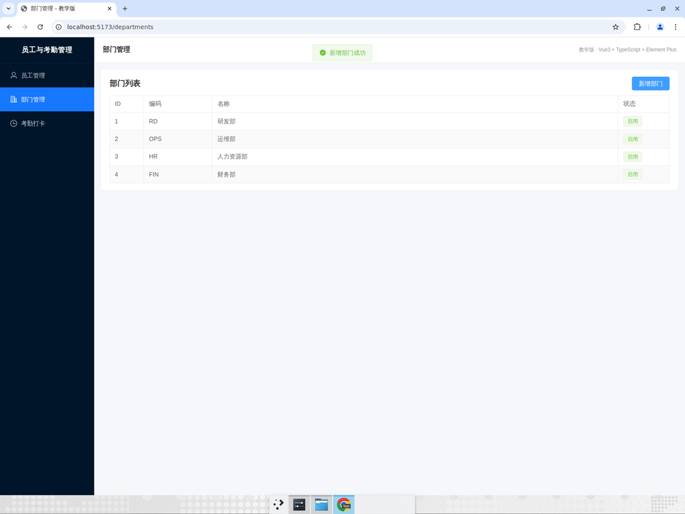
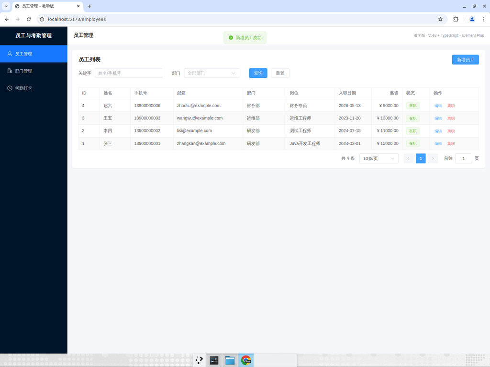
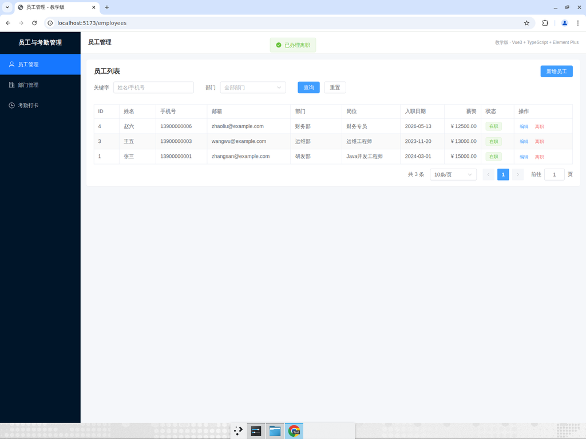
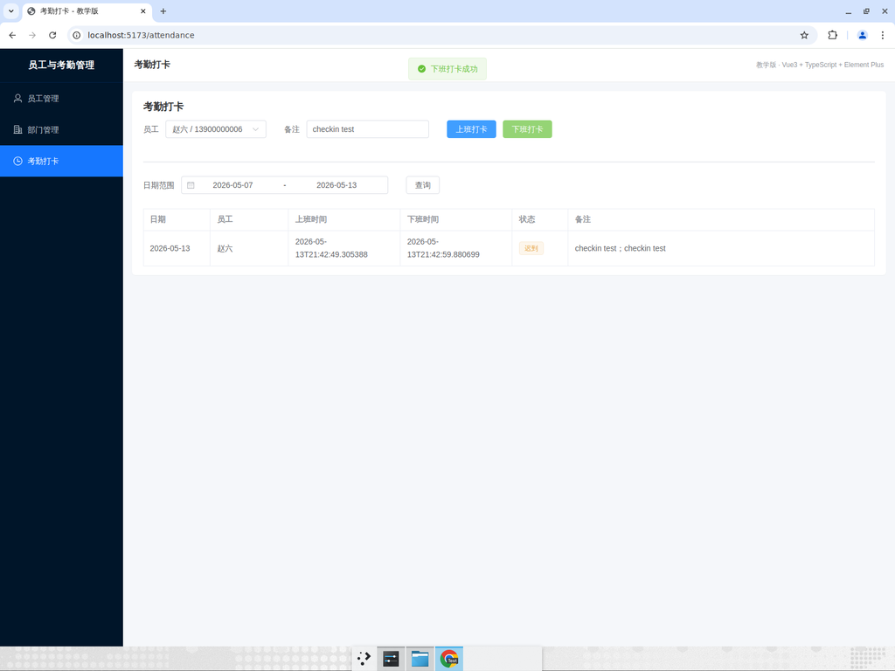

# 全栈端到端测试报告

> 本报告是项目交付时的真实测试记录。所有截图、视频均来自真实运行的应用，可作为初学者理解"什么叫端到端测试"的范本。

**对应的 PR**：[#1 feat: 添加 Vue3 全栈前端 + 12 章手把手教学文档](https://github.com/Uphomex/junior-java-company-demo/pull/1)
**测试方式**：本地启动后端 (Spring Boot @ :8080) + 前端 (Vite @ :5173 → proxy /api → :8080)，通过 UI 走完 3 条主流程。

---

## 一、概要

- **共 7 条断言全部通过**。
- 测试期间发现并修复了 1 个真实 Bug（详见第三节）。
- 视频演示：[`e2e-演示.mp4`](./e2e-演示.mp4)（2.5 MB，约 3 分钟，带 annotation 标注）

---

## 二、测试断言（每条一行）

| # | 测试 | 结果 |
|---|---|---|
| 1 | Precondition：部门列表加载 3 条种子数据（RD/OPS/HR） | passed |
| 2 | 新增 "FIN / 财务部" → 表格第 4 行回填 + Toast "新增部门成功" | passed |
| 3 | 新增员工 "赵六" → 列表头部新增 ID=4，部门=财务部、薪资=¥9000.00，共 4 条 | passed |
| 4 | 编辑赵六薪资到 12500 → 行显示 ¥ 12500.00 + Toast "修改员工成功" | passed |
| 5 | 离职赵六（财务部唯一员工）被业务规则拦截 → "部门至少保留 1 名在职员工" 错误 Toast | passed |
| 6 | 离职李四（研发部 2 人之一）→ 列表减少为 3 条 + Toast "已办理离职" | passed |
| 7 | 考勤上班 + 下班打卡 → 同一行 upsert，状态显示中文 "迟到"（非数字枚举） | passed |

> 关于第 5 条："离职唯一员工被拦截" 不是 Bug 而是预期业务规则。后端 `EmployeeService` 对孤立部门做了保护，前端 axios 拦截器把后端返回的错误码正确地展示成了 Toast。这是检验"前后端错误传播"是否工作的好用例。

---

## 三、测试期间发现的 Bug 与修复

### 现象

访问 `/employees`、`/attendance` 页面时，分页表格显示"暂无数据"，但分页栏正确显示 "共 3 条"——明显是请求成功但渲染失败。

### 根因（前后端契约不一致）

| 来源 | 字段定义 |
|---|---|
| 后端 `PageResult.java` | `private List<T> records;` |
| 前端 `types/index.ts`（修复前） | `list: T[]` |
| 前端 View（修复前） | `result.list` |

后端真正返回 `records`，前端却取 `result.list`，于是表格永远是空数组。

### 修复（commit `b653d2d`，已经合并到 main）

```diff
- list: T[]
+ records: T[]
```

```diff
- list.value = result.list
+ list.value = result.records
```

```diff
- employees.value = result.list
+ employees.value = result.records
```

涉及 3 个文件：`frontend/src/types/index.ts`、`frontend/src/views/employee/EmployeeListView.vue`、`frontend/src/views/attendance/AttendanceView.vue`。

### 给初学者的启示

1. **联调时一定要打开浏览器 Network 面板**，看到响应 200 但是页面空白，第一反应是看 response payload 的字段名。
2. **TypeScript 不会救你**：前后端是用 JSON 通信的，TS 类型只是 "我们以为后端长这样"的声明，不等于真实结构。
3. 永远以**后端 DTO 字段名**为准，让前端 TS 类型去对齐，而不是反过来。

---

## 四、关键证据截图

### 4.1 部门管理：新增 "FIN / 财务部"



- 第 4 行 `4 | FIN | 财务部 | 启用` 正确回填。
- 右上角绿色 Toast "新增部门成功"。

### 4.2 员工管理：新增 "赵六" 到财务部



- 表头多了一行 `4 | 赵六 | ... | 财务部 | 财务专员 | ¥ 9000.00 | 在职`。
- 共计 4 条。
- 这一步同时验证了：Pinia 部门 store 跨页面共享、Element Plus DatePicker、ElInputNumber、Select 都正确工作。

### 4.3 员工管理：编辑赵六薪资到 ¥ 12500


- 同一行的薪资从 ¥ 9000.00 变成 ¥ 12500.00。
- 顶部 Toast "修改员工成功"。

### 4.4 员工管理：离职校验拦截（预期行为）


- 顶部红色 Toast "部门至少保留 1 名在职员工"。
- 赵六 仍然在表格里。
- 这是后端 `EmployeeService.leave` 主动抛出的业务异常，被 `GlobalExceptionHandler` 包装成 `ApiResponse { code: 4001, message }`，再由前端 axios 拦截器统一吐到 ElMessage。整条链路联调成功。

### 4.5 员工管理：离职李四（多员工部门）成功



- 表格剩 3 条（赵六、王五、张三），李四消失。
- 顶部绿色 Toast "已办理离职"。

### 4.6 考勤：上班打卡


- 表格新增一行 `2026-05-13 | 赵六 | 21:42:49 | (空) | 迟到 | checkin test`。
- 状态 Tag 显示中文 "迟到"，而不是数字 `1`——证明 `formatAttendanceStatus` 工具函数与 Element Plus Tag 正确配合。
- 状态自动判定为 "迟到" 是因为打卡时间（21:42）远超 18:00。

### 4.7 考勤：下班打卡 — 同一行 upsert



- 没有新增第二行，原来那行被原地更新：
  - 下班时间被填入。
  - 备注由 "checkin test" 变成 "checkin test；checkin test"（后端 `attendance_service` 用 `；` 拼接历史备注）。
- 这是后端 `AttendanceService` 的 upsert 语义（同一员工同一天只有一条考勤记录），前后端都按这个规则工作。

---

## 五、完整视频

[`./e2e-演示.mp4`](./e2e-演示.mp4)（2.5 MB，约 3 分钟）

视频里有逐步 annotation 标注，包括每个 "test_start" 和 "assertion" 节点，可以当成"边看边解说"的教程。

---

## 六、环境信息

- 后端：`mvn spring-boot:run`（H2 in-memory 数据库，profile=default，已配置 CORS）
- 前端：`cd frontend && pnpm install && pnpm dev`（Vite 5.4，端口 5173，proxy `/api` → `:8080`）
- 浏览器：Chrome（Linux）

无 CI 配置，PR 没有 checks。

---

## 七、给初学者的"如何重现"清单

```bash
# 1. 克隆并切到 main
git clone https://github.com/Uphomex/junior-java-company-demo.git
cd junior-java-company-demo

# 2. 启动后端
mvn spring-boot:run
# → 后端跑起来后，看到 "Tomcat started on port 8080"

# 3. 另开一个终端，启动前端
cd frontend
pnpm install
pnpm dev
# → 看到 "Local: http://localhost:5173/"

# 4. 浏览器打开 http://localhost:5173，按本报告"四、关键证据截图"的顺序自己点一遍
```

如果你在重现过程中卡在哪里，先看 `docs/教学/11-从0到1全栈搭建步骤.md`。
